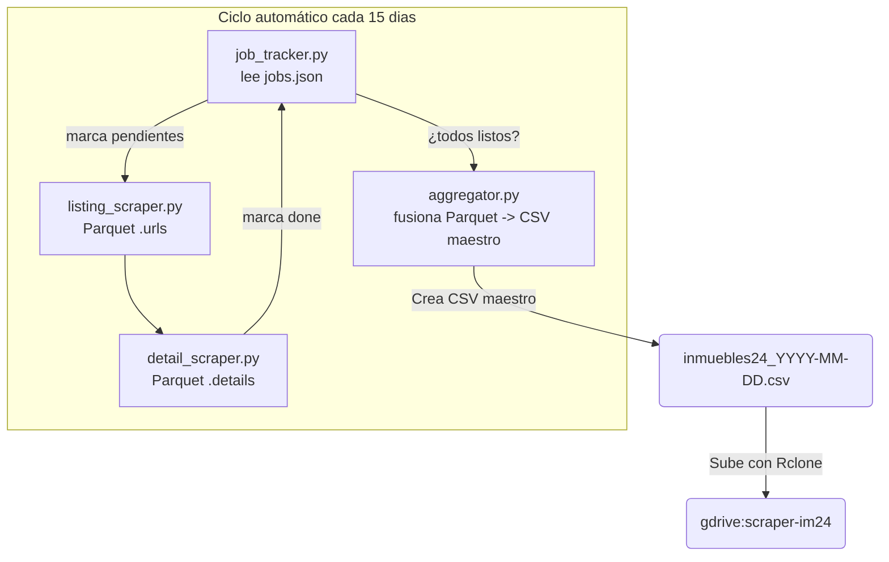

# Scraper Inmuebles24 · SeleniumBase + Docker

Proyecto de scraping inmobiliario optimizado para ejecutarse **cada 15 días** y generar un CSV maestro con todos los anuncios de 8 estados.

#Hardware:
Dell PowerEdge T710 · Xeon E5620 (8 hilos) · 24 GB RAM · RAID0-10 HDDs + Router Asus RT-AX82U, Ubuntu Server 24, no proxy)

## Tecnologías
- **Python 3.10** + SeleniumBase  
- **Docker** / Docker Compose  
- **GitHub Actions** (build & push)  

## Estructura

```
scraper-im24/
├── src/… # código Python
├── docker/… # Dockerfile
├── data/ # CSVs y jobs.json (git-ignorado)
└── scripts/… # cron_job.sh
```

## Flujo de scraping




## Uso rápido
```bash
cd scraper-im24
cp .env.example .env      # añade PROXY_URL cuando lo compres
docker compose build
docker compose up

# scraper-im24
